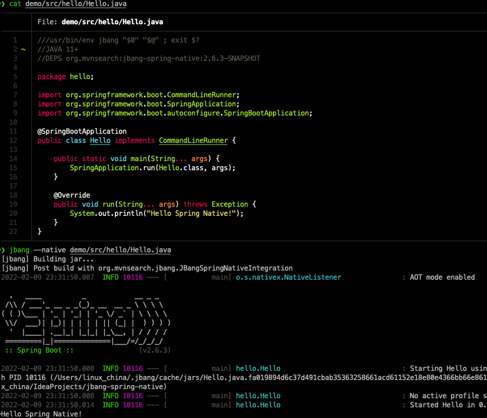

JBang build integration with Spring Native
==========================================



# How to use?

* Install GraalVM with native-image and set up `GRAALVM_HOME` env variable
* Create JBang script with `org.mvnsearch:jbang-spring-native:2.6.3-1` DEPS

```java
///usr/bin/env jbang "$0" "$@" ; exit $?
//JAVA 11+
//DEPS org.mvnsearch:jbang-spring-native:2.6.3-1
//JAVA_OPTIONS -agentlib:native-image-agent=config-merge-dir=/tmp/native-image-agent

package hello;

import org.springframework.boot.CommandLineRunner;
import org.springframework.boot.SpringApplication;
import org.springframework.boot.autoconfigure.SpringBootApplication;

@SpringBootApplication
public class Hello implements CommandLineRunner {

    public static void main(String... args) {
        SpringApplication.run(Hello.class, args);
    }

    @Override
    public void run(String... args) throws Exception {
        System.out.println("Hello Spring Native!");
    }
}
```

* Execute `jbang --native Hello.java`

# AOT configuration

```
//AOT:CONFIG removeXmlSupport=true removeSpelSupport=true
//AOT:CONFIG removeYamlSupport=false
```

# References

* JBang Build Integration: https://www.jbang.dev/documentation/guide/latest/integration.html
* Spring Native: https://docs.spring.io/spring-native/docs/0.11.2/reference/htmlsingle/
* Native Image Build Configuration: https://www.graalvm.org/22.0/reference-manual/native-image/BuildConfiguration/